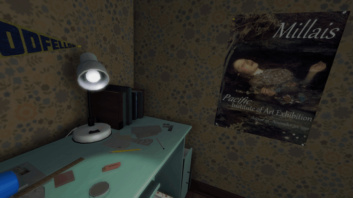

# Gone Home Head Tracking



An **unofficial** head tracking mod for Gone Home with decoupled look + aim support. Enables natural head movement using OpenTrack-compatible trackers while maintaining independent mouse aim.

## Features

- **Decoupled look + aim**: Look around freely with your head while mouse-controlled aim stays independent
- **6DOF head tracking**: Yaw, pitch, roll, and positional tracking (X/Y/Z) via OpenTrack UDP protocol

## Requirements

- Gone Home (Steam, GOG, or Epic)
- [OpenTrack](https://github.com/opentrack/opentrack) or a compatible head tracking app (smartphone, webcam, or dedicated hardware)
- Windows 10/11

## Installation

1. Download the latest release from the [Releases page](https://github.com/itsloopyo/gone-home-headtracking/releases)
2. Extract the ZIP anywhere
3. Double-click `install.cmd`
4. Configure OpenTrack to output UDP to `127.0.0.1:4242`
5. Launch Gone Home

The installer automatically finds your game by checking Steam, GOG, and Epic installations. If it can't find the game, either:
- Set the `GONEHOME_PATH` environment variable to your game folder
- Run from command prompt: `install.cmd "D:\Games\Gone Home"`

## Setting Up OpenTrack

1. Download and install [OpenTrack](https://github.com/opentrack/opentrack/releases)
2. Configure your tracker (Input):
   - For webcam: Select "neuralnet tracker"
   - For phone app: Select "UDP over network"
3. Configure output:
   - Select **UDP over network**
   - Host: `127.0.0.1`
   - Port: `4242`
4. Click **Start** to begin tracking
5. Launch Gone Home

### Phone App Setup

This mod includes built-in smoothing to handle network jitter, so if your tracking app already provides a filtered signal, you can send directly from your phone to the mod on port 4242 without needing OpenTrack on PC.

1. Install an OpenTrack-compatible head tracking app from your phone's app store
2. Configure your phone app to send to your PC's IP address on port 4242 (run `ipconfig` to find it, e.g. `192.168.1.100`)
3. Set the protocol to OpenTrack/UDP
4. Start tracking

**With OpenTrack (optional):** If you experience jerky motion, want curve mapping, or want a visual preview, route through OpenTrack instead. The mod already listens on port 4242, so OpenTrack's input must use a different port:
1. In OpenTrack, set Input to **UDP over network** on port **5252** (or any port other than 4242)
2. Set Output to **UDP over network** at `127.0.0.1:4242`
3. In your phone app, send to your PC's IP on port **5252** (matching OpenTrack's input port)
4. Make sure port 5252 is open in your PC's firewall for incoming UDP traffic

## Controls

| Key | Action |
|-----|--------|
| **Home** | Recenter (set current head position as neutral) |
| **End** | Toggle head tracking on/off |
| **Page Up** | Toggle position tracking (6DOF/3DOF) |

## Configuration

The mod creates `HeadTracking.cfg` in `GoneHome_Data\Managed` on first run. Edit it to customize:

```ini
# Network
UdpPort = 4242

# Keybindings (Unity KeyCode names)
# See https://docs.unity3d.com/ScriptReference/KeyCode.html
RecenterKey = Home
ToggleKey = End
PositionToggleKey = PageUp

# Sensitivity (multipliers, 0.1-5.0)
YawSensitivity = 1.0
PitchSensitivity = 1.0
RollSensitivity = 1.0

# Smoothing (0.0-1.0, remote connections enforce a minimum of 0.15)
Smoothing = 0.0

# Position tracking
PositionSensitivityX = 1.0
PositionSensitivityY = 1.0
PositionSensitivityZ = 1.0
InvertPositionX = true
InvertPositionY = false
InvertPositionZ = true

# Reticle
ShowReticle = true
ReticleColor = 1.0,1.0,1.0,1.0
```

## Troubleshooting

**Mod not loading:**
- Check `HeadTracking_BOOT.log` in the Managed folder
- Check `%TEMP%\HeadTracking_BOOT_ERROR.log` for errors
- Make sure all DLL files are in the Managed folder

**No tracking response:**
- Verify OpenTrack is running and outputting data
- Check UDP port matches (default 4242)
- Press **End** to enable tracking if it was toggled off
- Press **Home** to recenter

**Game crashes on startup:**
1. Run `uninstall.cmd` to restore original files
2. Verify game files through your launcher (Steam: Right-click > Properties > Local Files > Verify)
3. Try installing again

## Updating

Download the new release and run `install.cmd` again. It will update the mod files in place.

## Uninstalling

Run `uninstall.cmd` from the release folder. This restores the original `Assembly-CSharp.dll` from backup and removes all mod files.

You can also restore manually:
1. Delete from `GoneHome_Data\Managed`: `HeadTracking.dll`, `CameraUnlock.Core.dll`, `CameraUnlock.Core.Unity.dll`, `Mono.Cecil.dll`
2. Restore `Assembly-CSharp.dll`: rename `Assembly-CSharp.dll.original` back to `Assembly-CSharp.dll`, or verify game files through your launcher

## Building from Source

### Prerequisites

- [Pixi](https://pixi.sh) package manager
- .NET SDK 8.0+
- Gone Home installed (Unity DLLs are needed as build references)

### Build

```bash
git clone --recurse-submodules https://github.com/itsloopyo/gone-home-headtracking.git
cd gone-home-headtracking

# Copy required Unity DLLs from your game installation
pixi run setup-libs

# Build
pixi run build

# Build and install to game directory
pixi run install
```

### Pixi Tasks

| Task | Description |
|------|-------------|
| `pixi run setup-libs` | Copy Unity DLLs from game installation |
| `pixi run build` | Build the mod (Release configuration) |
| `pixi run install` | Build and install to game directory |
| `pixi run uninstall` | Remove the mod from the game |
| `pixi run package` | Create release ZIPs |
| `pixi run clean` | Clean build artifacts |
| `pixi run release` | Version bump, build, tag, and push |

## License

MIT License. See [LICENSE](LICENSE) for details.

## Credits

- [The Fullbright Company](https://fullbright.company/) - Gone Home
- [OpenTrack](https://github.com/opentrack/opentrack) - Head tracking software
- [Mono.Cecil](https://github.com/jbevain/cecil) - .NET assembly manipulation
